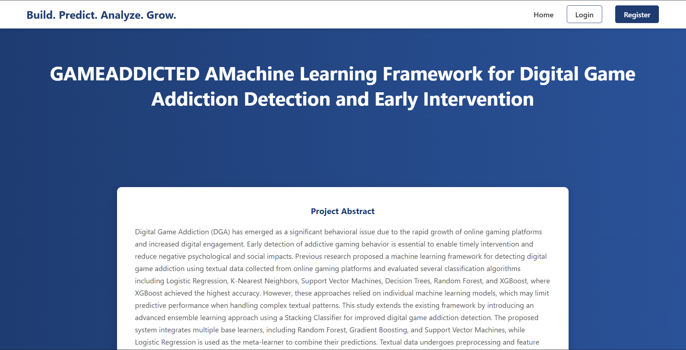
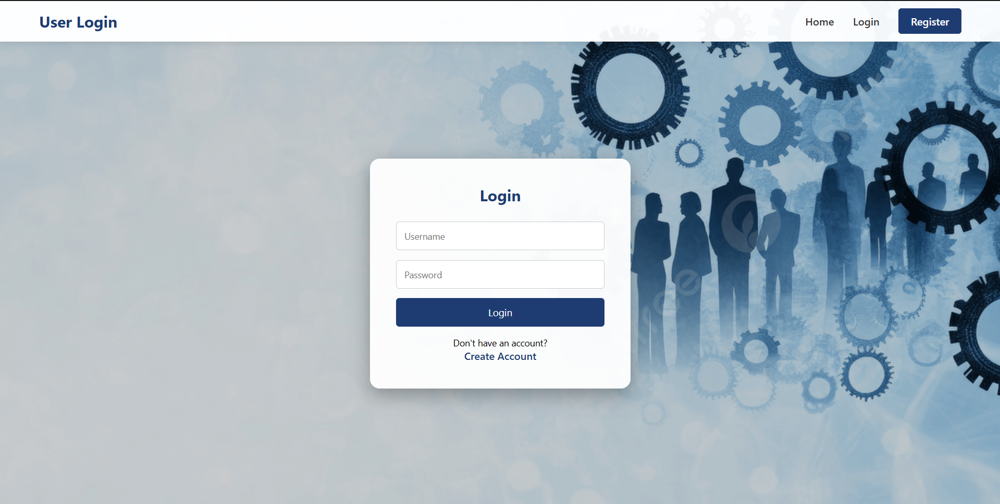
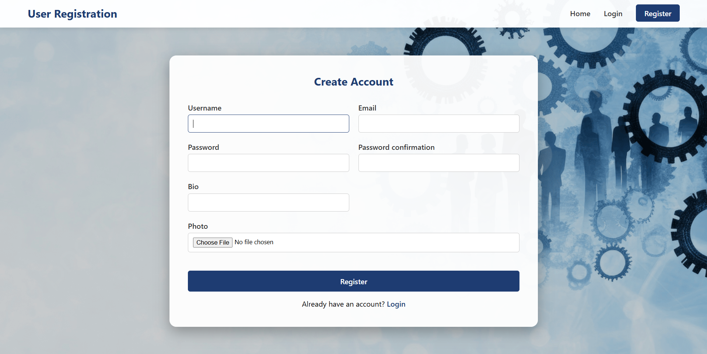
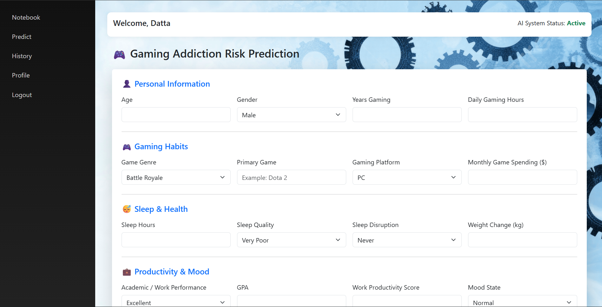
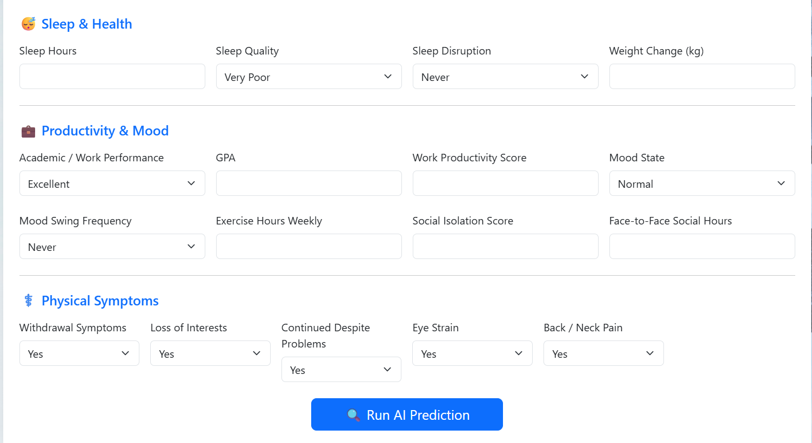
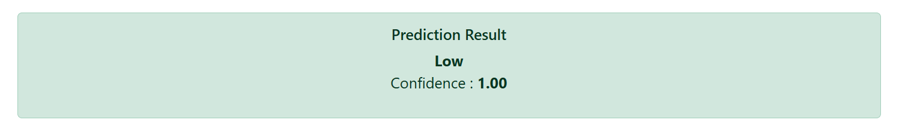
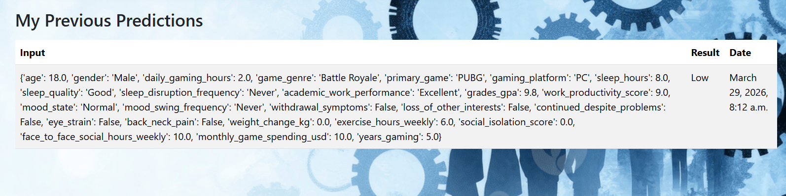
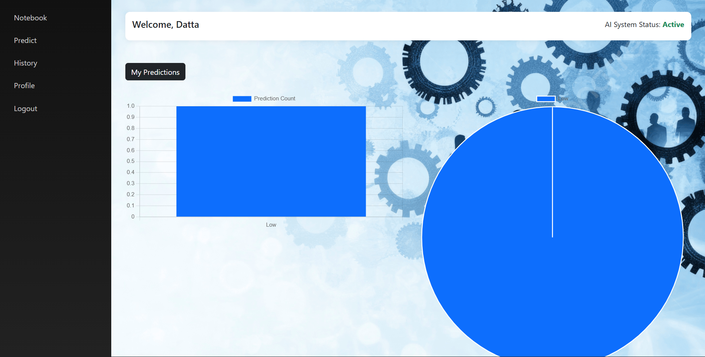
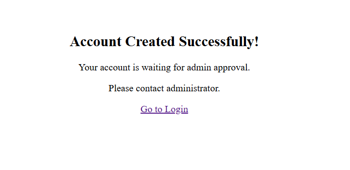

# 🎮 GAMEADDICTED — A Machine Learning Framework for Digital Game Addiction Detection and Early Intervention

> A full-stack web application that predicts digital game addiction risk using behavioral questionnaire data and a stacking ensemble classifier, built with Django and scikit-learn.


---

## 📌 Overview

GAMEADDICTED is a full-stack web application that assesses a user's risk of digital game addiction through a structured behavioral questionnaire. Users submit responses based on their gaming habits, health indicators, mood, and psychological patterns. The backend processes these through a trained **stacking ensemble ML model** — combining Random Forest, Gradient Boosting, and SVM as base learners with Logistic Regression as the meta-learner — to deliver an accurate, confidence-scored prediction.

The project addresses a growing public health concern: Digital Game Addiction (DGA), which has emerged as a significant behavioral issue due to the rapid growth of online gaming platforms and increased digital engagement.

---

## 🖼️ Screenshots

### 🏠 Home Page


### 🔐 Login & Register



### 📋 Prediction Form



### 🎯 Prediction Result


### 📊 History & Charts



### 🛡️ Admin Panel



---

## ✨ Features

- 🏠 **Landing Page** — Project abstract and introduction with tagline: *Build. Predict. Analyze. Grow.*
- 🔐 **User Auth System** — Register, Login, and Admin Approval workflow before access is granted
- 📋 **Multi-Section Prediction Form** — Covers Personal Info, Gaming Habits, Sleep & Health, Productivity & Mood, and Physical Symptoms
- 🤖 **Stacking Ensemble ML Model** — Meta-learner combining multiple base classifiers for high accuracy
- 🎯 **Confidence-Scored Output** — Displays addiction risk level (Low / Medium / High) with a confidence score
- 📊 **Analytics Dashboard** — Bar chart and pie chart visualizing the user's prediction history
- 📁 **Prediction History** — Full log of past predictions with input features, result, and date
- 🛡️ **Django Admin Panel** — Super admin can manage users, approve registrations, and manage tokens

---

## 🧠 ML Architecture

### Model: Stacking Ensemble Classifier

```
Input Features (Questionnaire Responses)
        │
        ▼
┌─────────────────────────────────────┐
│         Base Classifiers (Layer 1)  │
│  ┌──────────────┐  ┌─────────────┐  │
│  │ Random Forest│  │  Gradient   │  │
│  │              │  │  Boosting   │  │
│  └──────────────┘  └─────────────┘  │
│         ┌──────────────┐            │
│         │     SVM      │            │
│         └──────────────┘            │
└─────────────────────────────────────┘
        │  (Out-of-fold predictions)
        ▼
┌─────────────────────────────────────┐
│     Meta-Learner (Layer 2)          │
│       Logistic Regression           │
└─────────────────────────────────────┘
        │
        ▼
  Addiction Risk Level + Confidence Score
  (Low / Medium / High)
```

### Input Features
The model is trained on 20+ behavioral and demographic features including:

| Category | Features |
|---|---|
| Personal | Age, Gender, Years Gaming, Daily Gaming Hours |
| Gaming Habits | Game Genre, Primary Game, Platform, Monthly Spending |
| Sleep & Health | Sleep Hours, Sleep Quality, Sleep Disruption, Weight Change |
| Productivity | Academic/Work Performance, GPA, Productivity Score, Mood State |
| Social | Mood Swing Frequency, Social Isolation Score, Face-to-Face Hours |
| Physical Symptoms | Withdrawal, Loss of Interests, Eye Strain, Back/Neck Pain |

---

## 🛠️ Tech Stack

| Layer | Technology |
|---|---|
| **Frontend** | HTML5, CSS3, Bootstrap, JavaScript |
| **Backend** | Python, Django |
| **ML Framework** | scikit-learn |
| **Data Processing** | Pandas, NumPy |
| **Visualization** | Matplotlib, Seaborn |
| **Model Serialization** | Pickle / Joblib |
| **Database** | SQLite (Django ORM) |
| **Admin** | Django Admin Panel |

---

## 📂 Project Structure

```
GAMEADDICTED/
│
├── gameaddicted/               # Django project settings
├── detection/                  # Main app
│   ├── models.py               # DB models (UserProfile, Prediction)
│   ├── views.py                # Prediction logic + routing
│   ├── forms.py                # Questionnaire form
│   └── templates/              # HTML templates
│       ├── home.html
│       ├── login.html
│       ├── register.html
│       ├── dashboard.html
│       ├── result.html
│       └── history.html
│
├── ml_model/
│   ├── train_model.py          # Model training script
│   ├── stacking_model.pkl      # Serialized trained model
│   └── notebooks/              # EDA and evaluation notebooks
│
├── static/                     # CSS, JS, images
├── requirements.txt
└── manage.py
```

---

## 🚀 Getting Started

### Prerequisites
- Python 3.x
- pip

### Installation

```bash
# Clone the repository
git clone https://github.com/bnvsaisridatta/GAMEADDICTED.git
cd GAMEADDICTED

# Create virtual environment
python -m venv venv
source venv/bin/activate  # Windows: venv\Scripts\activate

# Install dependencies
pip install -r requirements.txt

# Run migrations
python manage.py migrate

# Create superuser (admin)
python manage.py createsuperuser

# Start the server
python manage.py runserver
```

Visit `http://127.0.0.1:8000` in your browser.

> **Note:** New user registrations require admin approval. Log in to the Django Admin panel at `/admin` to approve accounts.

---

## 👤 Developer

**B N V Sai Sri Datta**
B.Tech Computer Science Engineering, CMR Engineering College, Hyderabad

[](https://github.com/bnvsaisridatta)
[](https://linkedin.com/in/bnvsaisridatta)

---

> Built as a Mini Project in the 3rd Year of B.Tech Computer Science Engineering (2023–2027) at CMR Engineering College, Hyderabad.
